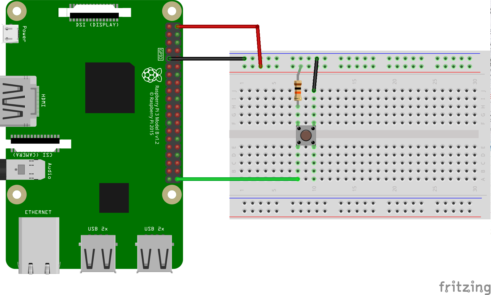

# Simple Peripheral I/O (Kotlin)

This Android Things app uses the Android Things GPIO APIs in a multi-threaded
environment.

## Introduction

Building off the [Simple PIO sample](https://github.com/androidthings/sample-simplepio/),
this sample provides more detail on how you would integrate these APIs into your own
application. It shows you how to:

- Handle GPIO callbacks (button presses) off the main thread using [Handlers](https://developer.android.com/reference/android/os/Handler) and [HandlerThreads](https://developer.android.com/reference/android/os/HandlerThread)

- Report results back to the main UI thread once that work is complete

- Make your Gpio components [Lifecycle-Aware](https://developer.android.com/topic/libraries/architecture/lifecycle) , so that each can shut down or re-initialize itself based on Android Lifecycle events, instead of writing overly complicated onDestroy() methods in your application's primary activity.

**IMPORTANT**: Please, note that these samples are not necessarily the easiest way to accomplish
a task. In particular, they handle all low level I/O protocols directly, on
purpose to showcase how to use the Peripheral APIs. In real world applications,
you should use or develop a suitable driver that encapsulates the manipulation
of low level APIs.


### Button

![Button sample demo][demo2.gif]

## Pre-requisites

- Android Things compatible board
- Android Studio 3.0+

For the Button sample:
- [Rainbow Hat for Android Things](https://shop.pimoroni.com/products/rainbow-hat-for-android-things) or the following individual components:
    - 1 push button
    - 1 resistor
    - 2 jumper wires
    - 1 breadboard

## Build and install

On Android Studio, select the module in the select box by the "Run" button, and
then click on the "Run" button.

If you prefer to run on the command line, type

```bash
./gradlew <module>:installDebug
adb shell am start com.example.androidthings.overview.MainActivity
```

If you have the Raspberry Pi [Rainbow Hat for Android Things](https://shop.pimoroni.com/products/rainbow-hat-for-android-things), just plug it onto your Raspberry Pi 3.



## Enable auto-launch behavior

This sample app is currently configured to launch only when deployed from your
development machine. To enable the main activity to launch automatically on boot,
add the following `intent-filter` to the app's manifest file:

```xml
<activity ...>

    <intent-filter>
        <action android:name="android.intent.action.MAIN"/>
        <category android:name="android.intent.category.HOME"/>
        <category android:name="android.intent.category.DEFAULT"/>
    </intent-filter>

</activity>
```

## License

Copyright 2018 The Android Open Source Project, Inc.

Licensed to the Apache Software Foundation (ASF) under one or more contributor
license agreements.  See the NOTICE file distributed with this work for
additional information regarding copyright ownership.  The ASF licenses this
file to you under the Apache License, Version 2.0 (the "License"); you may not
use this file except in compliance with the License.  You may obtain a copy of
the License at

  http://www.apache.org/licenses/LICENSE-2.0

Unless required by applicable law or agreed to in writing, software
distributed under the License is distributed on an "AS IS" BASIS, WITHOUT
WARRANTIES OR CONDITIONS OF ANY KIND, either express or implied.  See the
License for the specific language governing permissions and limitations under
the License.
